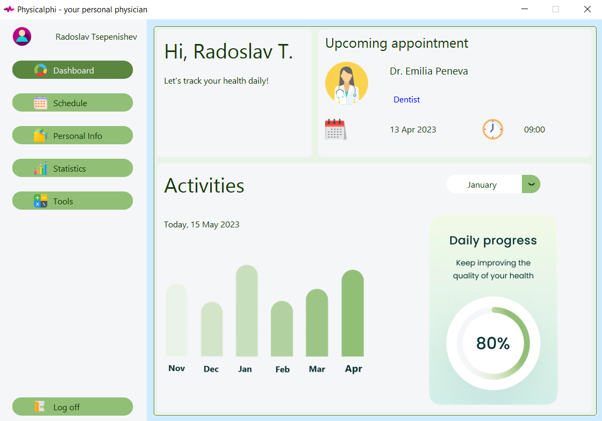
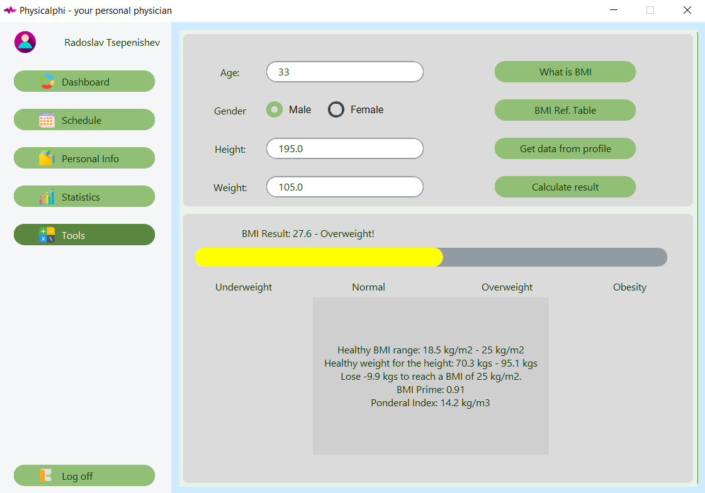
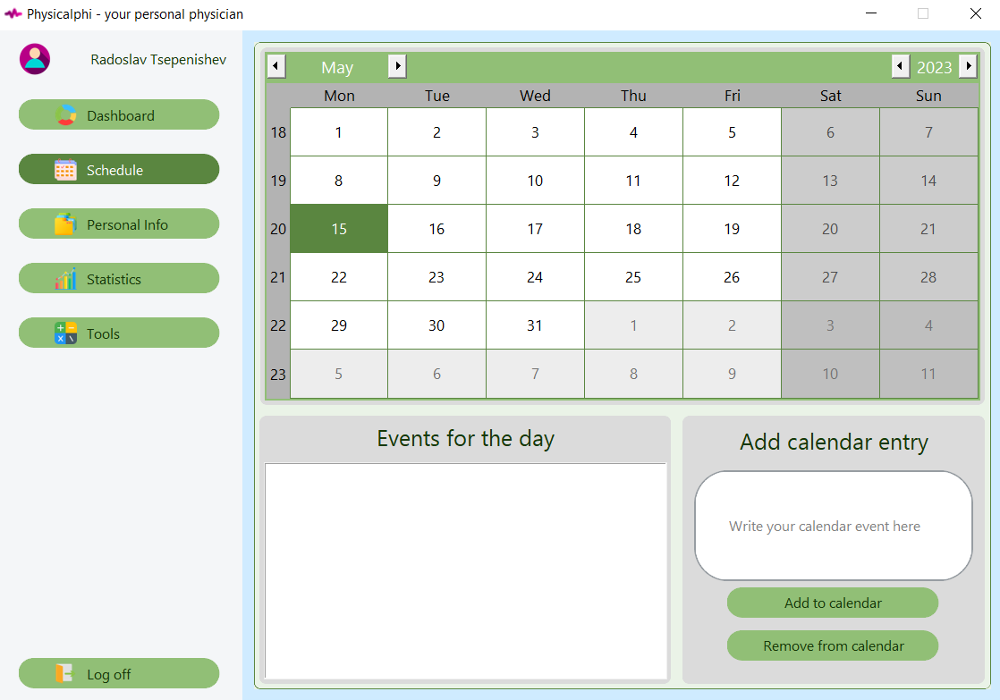
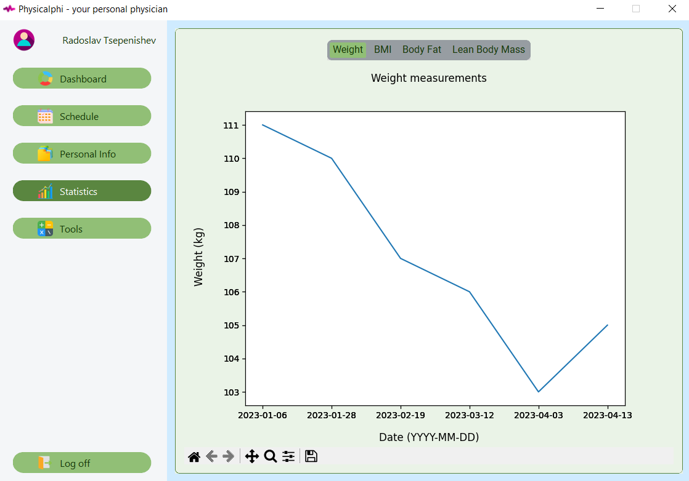

# Physicalphi
Your personal physician

Modern and beautiful health app that provides some useful functions such as: overview and suggestions regarding your health, calendar and reminders, statistics and graphs, calculators for various metrics.
The app utilizes Tkinter as main graphics library as well as CustomTkinter (https://github.com/TomSchimansky/CustomTkinter) for modern GUI elements.
It also stores all data in a Sqlite3 (https://sqlite.org/index.html) database and hashes passwords using Hashlib (https://docs.python.org/3/library/hashlib.html).
TkCalendar (https://pypi.org/project/tkcalendar/) is used for the calendar and reminders and MatPlotLib (https://matplotlib.org) for the health graphs.
It gets a number from a keyboard input.

The project can be accessed at: https://github.com/RadoslavTs/Physicalphi

Created by Lord Radoslav Tsepenishev

